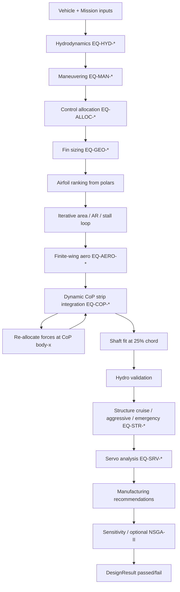

# Torpedo AUV Fin Design & Optimization 

**Version 0.1.0** — Professional CAE software for automatic sizing, analysis, and optimization of control fins on torpedo-shaped Autonomous Underwater Vehicles (AUVs).

This is **not** a geometry generator, CAD plugin, or simple calculator. It is an engineering design platform that chains marine vehicle dynamics, hydrodynamic theory, airfoil performance data, structural analysis, servo sizing, and manufacturing checks to **derive fin dimensions automatically** from vehicle and mission inputs.

---

## Table of contents

1. [What the software does](#what-the-software-does)
2. [Design philosophy](#design-philosophy)
3. [End-to-end engineering workflow](#end-to-end-engineering-workflow)
4. [Inputs and outputs](#inputs-and-outputs)
5. [Coordinate systems and conventions](#coordinate-systems-and-conventions)
6. [Data sources (polars vs Cp)](#data-sources-polars-vs-cp)
7. [Quick start](#quick-start)
8. [Golden vehicle benchmark](#golden-vehicle-benchmark)
9. [Repository layout (every folder)](#repository-layout-every-folder)
10. [Source code reference (every file)](#source-code-reference-every-file)
11. [Configuration and equations](#configuration-and-equations)
12. [Tests, verification, and CI](#tests-verification-and-ci)
13. [Generated outputs](#generated-outputs)
14. [Known limitations and roadmap](#known-limitations-and-roadmap)
15. [Further reading](#further-reading)

---

## What the software does

Given a torpedo AUV and a maneuvering requirement, the suite computes:

| Stage | What is computed |
|-------|-------------------|
| **Vehicle** | Volume, displacement, CG, fin station, added mass estimates |
| **Hydrodynamics** | Reynolds number, ITTC friction, Hoerner drag, dynamic pressure |
| **Maneuvering** | Required yaw moment, control authority, design load factor |
| **Control allocation** | Per-fin lift for an aft X-tail (4 fins), lever arms |
| **Fin sizing** | Area, span, root/tip chord, taper, MAC, thickness, mass, corner coordinates |
| **Airfoil selection** | Rank NACA candidates from XFOIL polars at MAC Reynolds number |
| **Finite-wing aero** | 3D CL, CD, α, stall margin (Helmbold correction) |
| **Center of pressure** | 3D CoP via strip theory + chordwise Cp integration |
| **Shaft fit** | Local airfoil thickness at 25% chord vs servo shaft OD |
| **Hydro validation** | Authority margin, stall margin, drag budget checks |
| **Structure** | Cantilever beam: bending, shear, torsion, von Mises, tip deflection, FoS |
| **Servo** | Hinge moment, torque utilization, shaft stress, actuation time |
| **Manufacturing** | Printability, wall thickness, TE thickness recommendations |
| **Sensitivity** | ±10% perturbation on key inputs |
| **Optimization** | Optional NSGA-II (drag vs mass) via `pymoo` |
| **Export** | JSON/TXT/HTML reports, STL, STEP wire, Fusion 360 params, Gazebo SDF, ROS 2 URDF |

The user does **not** specify fin dimensions by default — the solver derives them. Optional overrides for root chord, span, and tip chord are supported in the GUI.

---

## Design philosophy

These principles govern the codebase (see also `FinDesigner_Software_Design_Specification.md`):

1. **Physics first** — Equations over arbitrary constants; every formula is registered with an ID.
2. **No magic numbers** — Engineering defaults live in `configs/defaults.yaml`, not scattered in code.
3. **Traceability** — `docs/equations/equation_register.yaml` is the mathematical constitution; production modules reference equation IDs.
4. **Separation of concerns** — `domain/` (pure engineering), `application/` (orchestration), `infrastructure/` (config), `ui/` (PySide6), `adapters/` (external formats).
5. **Verification** — Jupyter notebooks under `verification/` recompute results independently.
6. **Replaceable data** — Airfoil Cp archives use a fixed CSV layout so bootstrap data can be swapped for real XFOIL dumps without code changes.

---

## End-to-end engineering workflow

The main orchestrator is `run_design_pipeline()` in `src/auv_fin_design/application/pipeline.py`.



### Iteration loops

1. **Sizing loop** — Adjusts fin area (and optionally aspect ratio) until required CL fits within a stall margin, or span hits `max_span_over_diameter × diameter`.
2. **CoP lever loop** — Computes integrated center of pressure, then re-runs control allocation using the CoP body-x position as the force station (one iteration).
3. **Airfoil loop** — Up to `max_airfoil_iterations` (default 25) to converge area when CL requirements change.

### Pass / fail criteria (`DesignResult.passed`)

All must be true:

- No geometry constraint violations (span, tip chord, TE thickness, etc.)
- Shaft fits at hinge (25% chord local thickness ≥ `shaft_clearance_factor × shaft_diameter`)
- Hydrodynamic validation OK (authority, stall margin)
- Structure FoS and tip deflection OK (cruise, aggressive, emergency)
- Servo continuous utilization and shaft stress OK
- Manufacturing printable

---

## Inputs and outputs

### Primary inputs (GUI / golden YAML)

| Input | Example | Module |
|-------|---------|--------|
| Length, diameter, mass | 1.35 m, 168.5 mm, 24 kg | `vehicle/model.py` |
| Water type | freshwater / seawater | `constants/fluids.py` |
| Design & max speed | 1.5 / 2.0 m/s | `mission` |
| Turn radius & time | 6 m / 30 s | `maneuvering.py` |
| Fin count & config | 4 × X-tail | `vehicle/model.py` |
| Fin root LE station | 0.92 × L (aft) | `vehicle/model.py` |
| Material | PLA, ABS, … | `constants/materials.py` |
| Servo torque, shaft, travel | 3.481 N·m (35.5 kg·cm), 6 mm, 180° | `servo/analysis.py` |

### Optional geometry overrides (GUI)

- Root chord (m)
- Span (m)
- Tip chord (m)

When enabled, the solver keeps these dimensions and warns if lift cannot be met.

### Key outputs

| Output | Description |
|--------|-------------|
| **Fin planform** | Area, span, chords, AR, taper, sweep, MAC, thickness, mass |
| **Corner coordinates** | LE/TE at root and tip in hinge frame (m and mm) |
| **Airfoil** | Selected NACA section (0012, 0015, or 0018) |
| **Aero** | α, CL, CD, stall margin, Reynolds at MAC |
| **Center of pressure** | x_cp from LE, hinge frame, z_cp from root, hinge moment, verification |
| **Shaft fit** | Thickness at 25% chord vs required clearance |
| **Maneuver deflection** | Required vs usable fin deflection for design maneuver |
| **Structure** | Stress, FoS, tip deflection per load case |
| **Servo** | Torque utilization, shaft OK, actuation time |
| **Reports & CAD** | See [Generated outputs](#generated-outputs) |

---

## Coordinate systems and conventions

### Control-surface frame (fin geometry output)

- **Origin:** Root hinge line at **25% chord from leading edge** (fixed — not moved to CoP or max thickness).
- **+X:** Chordwise, leading edge → trailing edge.
- **+Z:** Spanwise, root → tip.
- Corner points (LE_root, TE_root, LE_tip, TE_tip) are reported in this frame in metres and millimetres.

### Body frame

- **+X:** Forward (nose).
- Fin root leading-edge station: `x_fin_root_le = fin_root_le_fraction × length`.
- CoP body position: `x_force = x_fin_root_le + x_cp_from_le`.

### Pressure convention (CoP module)

- `ΔCp = Cp_lower − Cp_upper` (positive → lift on positive α).
- Chordwise integration: `cn = ∫ ΔCp d(x/c)`, `x_cp/c = ∫ (x/c) ΔCp d(x/c) / cn`.

### Hinge

- Servo shaft axis is at **25% chord** at the root.
- Hinge moment is computed about this axis from integrated strip loads.

---

## Data sources (polars vs Cp)

The project uses **two different kinds** of airfoil aerodynamic data.

### 1. Polar data (trusted — your downloads)

**Location:** `data/NACA0012/`, `data/NACA0015/`, `data/NACA0018/`

**Source:** [AirfoilTools](http://airfoiltools.com) / XFOIL polars (CSV and native XFOIL `.txt` format).

**Content per file:** One Reynolds number; columns `Alpha, Cl, Cd, Cdp, Cm, …` — whole-section coefficients vs angle of attack.

**Used for:** Airfoil ranking, lift curve slope, stall angle, CL/CD at design α, finite-wing correction, hydro validation.

**Also copied to:** `data/airfoils/naca00xx/polars/` (identical files; the running app loads from `data/NACA00xx/` via `AirfoilDatabase`).

### 2. Cp pressure distributions (bootstrap — replace for accuracy)

**Location:** `data/airfoils/naca00xx/cp/Re<Reynolds>/alpha<deg>.csv`

**Source:** Generated by `scripts/generate_cp_dataset.py` (`cp_source: vortex_panel_bootstrap_v1` in `metadata.yaml`). **Not** from XFOIL.

**Content per file:** Chordwise stations `x_c, Cp_upper, Cp_lower` at one (Re, α).

**Equations in generator (inviscid approximation):**

- Glauert thin-airfoil loading: `ΔCp_α = 2α √((1−x)/x)`
- Thickness perturbation: `Cp_t ≈ −2 d(y_t)/d(x/c)` from NACA 4-digit thickness
- Split: `Cp_upper = −½ΔCp_α + Cp_t`, `Cp_lower = +½ΔCp_α + Cp_t`
- **Reynolds number is not modeled** — same Cp duplicated across all `Re*` folders

**Used for:** Strip-theory center-of-pressure integration only.

**To improve CoP accuracy:** Replace `cp/` CSV files with real XFOIL Cp dumps (same column layout) without changing code.

### 3. Airfoil coordinates

| File | Purpose |
|------|---------|
| `data/NACA00xx/coordinates.dat` | 2D profile points (your download) |
| `data/airfoils/naca00xx/geometry.dat` | Same profile, generated NACA 4-digit |
| `data/airfoils/naca00xx/coordinates.dat` | Copy of legacy coordinates when present |

Used for NACA thickness at 25% chord (shaft fit) and STL export.

---

## Quick start

```bash
cd /home/samyak/fins
python3 -m venv .venv
source .venv/bin/activate
pip install -e ".[dev]"
pytest -q
```

### Desktop GUI

```bash
auv-fin-gui
# or
python -m auv_fin_design.ui.app
# or
auv-fin --gui
```

### CLI (golden vehicle, JSON to stdout)

```bash
auv-fin --golden --no-sensitivity
auv-fin --golden --export-all          # reports + simulation bundle
auv-fin --golden --optimize            # optional NSGA-II (pip install -e ".[opt]")
auv-fin --golden --max-span-over-d 0.55
auv-fin --airfoil NACA0012 --material PLA
```

Exit code `0` = design passed all checks; `2` = failed (still prints JSON).

### Regenerate bootstrap Cp archives

```bash
python scripts/generate_cp_dataset.py
```

---

## Golden vehicle benchmark

Reference case: `benchmarks/golden_vehicle/golden_vehicle.yaml`

| Parameter | Value |
|-----------|-------|
| Length | 1.35 m |
| Diameter | 168.5 mm |
| Mass | 24 kg |
| Water | Freshwater |
| Design speed | 1.5 m/s |
| Max speed | 2.0 m/s |
| Turn radius / time | 6 m / 30 s |
| Fins | 4 × aft X-tail (`fin_root_le = 0.92 L`) |
| Material | PLA |
| Servo | 3.481 N·m (35.5 kg·cm stall), 6 mm shaft, 180° travel |

**Packaging note:** Default `max_span_over_diameter = 0.55` allows the golden case to pass. At `0.45 × D` the solver correctly reports a packaging violation — the turn cannot be met with a 5° stall margin under that span limit. See `docs/equations/REVIEW_STATUS.md`.

---

## Repository layout (every folder)

```
fins/
├── .github/workflows/     # CI pipeline
├── benchmarks/            # Regression reference data
├── configs/               # Engineering defaults (YAML)
├── data/                  # Airfoil polars, coordinates, Cp archives
├── docs/equations/        # Equation register + review status
├── exports/               # Generated CAD/sim bundles (gitignored contents)
├── reports/               # Generated engineering reports (gitignored contents)
├── scripts/               # Maintenance / data generation scripts
├── src/auv_fin_design/    # Production Python package
├── tests/                 # Unit, integration, benchmark tests
└── verification/          # Jupyter verification notebooks
```

### `.github/workflows/`

| File | Purpose |
|------|---------|
| `ci.yml` | GitHub Actions: install package, run `pytest -q`, smoke `auv-fin --golden` on Ubuntu + Python 3.11 |

### `benchmarks/`

| File / folder | Purpose |
|---------------|---------|
| `golden_vehicle/golden_vehicle.yaml` | Canonical vehicle + mission + servo inputs for regression and CLI `--golden` |
| `center_of_pressure_reference.json` | Expected CoP solver outputs for one fin configuration (regression) |

### `configs/`

| File | Purpose |
|------|---------|
| `defaults.yaml` | **Single source of defaults:** fluids, sizing, maneuvering, structure FoS, servo, geometry limits, airfoil ranking weights, NSGA-II params, hydrodynamics, center-of-pressure solver, tolerances |

### `data/`

#### `data/NACA0012/`, `data/NACA0015/`, `data/NACA0018/` (legacy layout — **active for polars**)

| File pattern | Purpose |
|--------------|---------|
| `coordinates.dat` | Airfoil profile (x, y) — NACA 4-digit |
| `xf-naca*.csv` | XFOIL polar from AirfoilTools (Alpha, Cl, Cd, Cm, …) at fixed Re |
| `xf-naca*.txt` | Same polar in native XFOIL listing format |

Reynolds numbers per airfoil: **50k, 100k, 200k, 500k, 1M**.

#### `data/airfoils/naca0012/`, `naca0015/`, `naca0018/` (structured layout — **active for Cp**)

| Path | Purpose |
|------|---------|
| `metadata.yaml` | Airfoil name, thickness ratio, `cp_source` tag, replacement note |
| `geometry.dat` | Generated NACA coordinate file |
| `coordinates.dat` | Copy of legacy coordinates (when present) |
| `polars/xf-*.csv` | Bit-identical copies of `data/NACA00xx/` polar CSVs |
| `cp/Re<Re>/alpha<deg>.csv` | Chordwise Cp bootstrap files |

**Cp archive scale:** 3 airfoils × 5 Reynolds folders × 21 alpha files = **330 CSV files** total.

Alpha filenames: `alpha-4.00.csv` … `alpha16.00.csv` (roughly −4° to +16° in 1° steps).

Each Cp CSV: ~80 rows of `x_c, Cp_upper, Cp_lower` (cosine-spaced chord stations).

### `docs/equations/`

| File | Purpose |
|------|---------|
| `equation_register.yaml` | All engineering equations with IDs, formulas, variables, units, implementation modules, test references (~70+ equation entries) |
| `REVIEW_STATUS.md` | Implementation checklist and known packaging notes |

### `exports/` and `reports/` (runtime output)

Gitignored except `.gitkeep` placeholders. Populated by `--export-all` or GUI export.

### `scripts/`

| File | Purpose |
|------|---------|
| `generate_cp_dataset.py` | Bootstrap `data/airfoils/*/cp/` from thin-airfoil + thickness model; copies polars and geometry |

### `src/auv_fin_design/`

Production package — see [Source code reference](#source-code-reference-every-file).

### `tests/`

| Path | Purpose |
|------|---------|
| `unit/test_vehicle.py` | Vehicle / mission models |
| `unit/test_hydrodynamics.py` | Drag, Reynolds, dynamic pressure |
| `unit/test_control.py` | Maneuvering and X-tail allocation |
| `unit/test_geometry_aero.py` | Fin sizing, finite wing, NACA |
| `unit/test_center_of_pressure.py` | CoP integration, strips, providers |
| `unit/test_equation_register.py` | Equation register integrity |
| `unit/test_stl_export.py` | STL mesh export |
| `integration/test_full_pipeline.py` | End-to-end pipeline smoke |
| `benchmarks/test_golden_vehicle.py` | Golden vehicle regression |

### `verification/`

Independent Jupyter notebooks that recompute equations step-by-step and compare to production code (≤1% engineering tolerance target).

| Notebook | Module verified |
|----------|-----------------|
| `verify_vehicle_model.ipynb` | Vehicle geometry, CG, fin station |
| `verify_hydrodynamics.ipynb` | ITTC, Hoerner, dynamic pressure |
| `verify_control_allocation.ipynb` | Yaw moment, X-tail allocation |
| `verify_fin_sizing.ipynb` | Planform sizing, constraints |
| `verify_hydro_validation.ipynb` | Authority and stall checks |
| `verify_center_of_pressure.ipynb` | Cp integration, strip theory, CoP migration |

### Root files

| File | Purpose |
|------|---------|
| `README.md` | This document |
| `FinDesigner_Software_Design_Specification.md` | Full SRDS product specification (Chapter 1 workflow, requirements, roadmap) |
| `pyproject.toml` | Package metadata, dependencies, entry points (`auv-fin`, `auv-fin-gui`), pytest/ruff/mypy config |
| `pytest.ini` | Pytest paths; disables `launch_testing` plugin |
| `.gitignore` | Ignores venv, caches, generated `exports/` and `reports/` |

---

## Source code reference (every file)

Package root: `src/auv_fin_design/`

### `application/` — orchestration

| File | Responsibility |
|------|----------------|
| `pipeline.py` | **`run_design_pipeline()`** — full SRDS workflow; `DesignResult`, `GeometryOverride`, `load_golden_vehicle()` |
| `cli.py` | Command-line entry: `--golden`, `--gui`, `--export-all`, `--optimize`, JSON output |

### `ui/` — PySide6 desktop app

| File | Responsibility |
|------|----------------|
| `app.py` | GUI entry point (`auv-fin-gui`) |
| `main_window.py` | Main window: vehicle/mission/servo inputs, optional fin dimensions, run design, display results (dimensions mm, CoP, shaft fit, structure, servo), export buttons |

### `adapters/` — external format bridges

| File | Responsibility |
|------|----------------|
| `export_bundle.py` | Fusion 360 parameter JSON, STEP AP203 wireframe, Gazebo SDF, ROS 2 URDF, combined `export_simulation_bundle()` |

### `infrastructure/config/`

| File | Responsibility |
|------|----------------|
| `loader.py` | `repo_root()`, `load_defaults()`, `load_yaml()`, `load_equation_register()` |

### `domain/vehicle/`

| File | Responsibility |
|------|----------------|
| `model.py` | `VehicleModel` (L, D, mass, water, CG, fin layout), `MissionModel` (speeds, turn radius/time) — EQ-VEH-* |

### `domain/hydrodynamics/`

| File | Responsibility |
|------|----------------|
| `estimator.py` | `estimate_hydrodynamics()` — ITTC-57 friction, Hoerner streamlined drag, crossflow, added mass — EQ-HYD-* |

### `domain/control/`

| File | Responsibility |
|------|----------------|
| `maneuvering.py` | `compute_control_requirement()` — yaw moment from turn kinematics — EQ-MAN-* |
| `allocation.py` | `allocate_x_tail_yaw()` — 4-fin X-tail lift split, lever arms — EQ-ALLOC-* |

### `domain/geometry/`

| File | Responsibility |
|------|----------------|
| `sizing.py` | `size_fin()`, `build_fin_from_planform()`, `apply_dimension_overrides()`, corner points, `geometry_to_dict()`, `format_fin_dimensions_lines()`, constraint checks — EQ-GEO-* |
| `shaft_fit.py` | `check_shaft_fit_at_hinge()` — NACA thickness at 25% chord vs shaft OD + clearance factor |

### `domain/airfoil/`

| File | Responsibility |
|------|----------------|
| `database.py` | `AirfoilDatabase` — loads `data/NACA00xx/*.csv` polars; log-Re interpolation — EQ-AERO-006 |
| `finite_wing.py` | Helmbold 3D lift slope, `evaluate_finite_wing()`, `alpha_for_required_cl()` — EQ-AERO-001–005 |
| `naca.py` | NACA 4-digit coordinate generation, thickness `yt(x)`, full thickness at chord fraction |
| `center_of_pressure.py` | **Legacy** simplified CoP estimate (`0.25 − Cm/CL`); superseded by `domain/center_of_pressure/` for pipeline |

### `domain/center_of_pressure/` — dynamic 3D CoP (strip + Cp integration)

| File | Responsibility |
|------|----------------|
| `models.py` | Pydantic models: `PressureDistribution`, `StripResult`, `CenterOfPressureResult`, `CoPVerification`, `ManeuverDeflection`, `CoPSolverConfig` |
| `constants.py` | Default solver parameters, equation ID strings |
| `exceptions.py` | `CoPDataError`, `CoPIntegrationError`, etc. |
| `validators.py` | Cp array validation, monotonic x/c checks |
| `utils.py` | Path resolution, LRU cache, Re/alpha filename parsing |
| `cp_provider.py` | Abstract `CenterOfPressureProvider` |
| `xfoil_provider.py` | Loads precomputed CSV archives from `data/airfoils/.../cp/` |
| `cp_interpolator.py` | Interpolate Cp in Re, α; bilinear on archived grid |
| `pressure_integrator.py` | Chordwise Simpson integration — **EQ-COP-001, EQ-COP-002** |
| `strip_theory.py` | Spanwise strips, local chord, per-strip Cp integration — EQ-COP-003, EQ-COP-004 |
| `finite_wing_correction.py` | Helmbold wrapper for strip CL slope |
| `cp_solver.py` | `CoPSolver`, `solve_center_of_pressure()` — orchestration, verification, maneuver deflection — EQ-COP-005–007 |
| `analytical_provider.py` | Stub provider (not implemented) |
| `cfd_provider.py` | Stub provider (not implemented) |
| `experimental_provider.py` | Stub provider (not implemented) |
| `__init__.py` | Public exports |

### `domain/structural/`

| File | Responsibility |
|------|----------------|
| `beam.py` | Cantilever fin as elliptical section beam: I, J, bending, shear, torsion, von Mises, tip deflection, FoS — EQ-STR-* |

### `domain/servo/`

| File | Responsibility |
|------|----------------|
| `analysis.py` | `analyze_servo()` — hinge moment, torque utilization, shaft stress, actuation time — EQ-SRV-* |

### `domain/validation/`

| File | Responsibility |
|------|----------------|
| `hydro.py` | `validate_hydrodynamics()` — authority margin, stall margin, overall OK |
| `sensitivity.py` | `run_sensitivity()` — ±10% on length, diameter, mass, speed, turn radius |

### `domain/manufacturing/`

| File | Responsibility |
|------|----------------|
| `recommendations.py` | Printability, wall thickness, TE thickness guidance |
| `stl_export.py` | `export_fin_stl()` — lofted NACA sections to binary STL |

### `domain/optimization/`

| File | Responsibility |
|------|----------------|
| `nsga2.py` | `run_nsga2()` — multi-objective drag vs mass (requires `pymoo`) |

### `domain/reporting/`

| File | Responsibility |
|------|----------------|
| `report.py` | `result_to_dict()`, Markdown report |
| `export.py` | JSON, plain text, HTML reports; `write_all_reports()` |

### `domain/constants/`

| File | Responsibility |
|------|----------------|
| `fluids.py` | Freshwater / seawater properties — EQ-FLUID-* |
| `materials.py` | PLA, ABS, PETG, aluminium, … density, yield, E, ν |

### Package `__init__.py` files

Mark subpackages; `src/auv_fin_design/__init__.py` exposes package version.

### `utilities/`

Placeholder package (`__init__.py` only) for future shared helpers.

---

## Configuration and equations

### `configs/defaults.yaml` sections

| Section | Key parameters |
|---------|----------------|
| `fluids` | ρ, μ, ν, g for freshwater and seawater |
| `sizing` | Initial CL, AR, taper, sweep, Oswald e, stall margin, iteration limits |
| `maneuvering` | Control margin, emergency load factor |
| `structure` | FoS cruise/aggressive/emergency, tip deflection limit |
| `servo` | Rated torque, shaft diameter, max rotation, efficiency, utilization limits |
| `geometry_constraints` | max span/D, min tip chord, min TE/wall thickness, shaft clearance factor |
| `airfoil_ranking_weights` | Weighted score for airfoil auto-selection |
| `optimization` | NSGA-II population, generations, objectives |
| `hydrodynamics` | Crossflow Cd, axial added-mass factor |
| `center_of_pressure` | Provider, strip count, integration tolerance, verification tolerances, hinge fraction |
| `tolerances` | Engineering and geometry relative tolerances |

### Equation register categories (`docs/equations/equation_register.yaml`)

| Prefix | Topic | Count (approx.) |
|--------|-------|-----------------|
| EQ-FLUID-* | Water properties | 2 |
| EQ-VEH-* | Vehicle geometry, CG, fin station | 6 |
| EQ-HYD-* | Drag, Reynolds, dynamic pressure, validation | 17 |
| EQ-MAN-* | Maneuvering loads | 7 |
| EQ-ALLOC-* | Control allocation | 4 |
| EQ-GEO-* | Fin planform sizing | 7 |
| EQ-AERO-* | Finite wing, polars, legacy CoP | 8 |
| EQ-COP-* | Dynamic CoP strip integration | 7 |
| EQ-STR-* | Structural beam | 7 |
| EQ-SRV-* | Servo / hinge | 2 |
| EQ-NACA-* | NACA 4-digit thickness | 1 |

Entries may be marked `proposed` until engineering approval; see register for status per equation.

---

## Tests, verification, and CI

```bash
pytest -q                    # all tests
pytest tests/unit -q         # unit only
pytest tests/integration -q  # pipeline integration
```

CI (`.github/workflows/ci.yml`) runs on every push/PR: install `.[dev]`, pytest, golden smoke.

CoP regression: `benchmarks/center_of_pressure_reference.json` + `tests/unit/test_center_of_pressure.py`.

---

## Generated outputs

When using `--export-all` or GUI export:

### `reports/`

| File | Format |
|------|--------|
| `engineering_report.json` | Full structured result |
| `engineering_report.txt` | Human-readable summary |
| `engineering_report.html` | Formatted HTML report |
| `last_design_report.json` / `.txt` | Latest run snapshot |

### `exports/`

| File / folder | Format |
|---------------|--------|
| `fin.stl` | Binary STL of one fin solid |
| `sim_bundle/fusion360_parameters.json` | Parametric dimensions for Fusion 360 |
| `sim_bundle/hydro_params.json` | Hydrodynamic summary |
| `sim_bundle/*.step` | STEP AP203 wireframe (approximate) |
| `sim_bundle/*.sdf` | Gazebo model snippet |
| `sim_bundle/*.urdf` | ROS 2 description snippet |

---

## Known limitations and roadmap

| Item | Status |
|------|--------|
| Cp data | Bootstrap analytical — **not** XFOIL-quality; replace `data/airfoils/*/cp/` for accurate CoP |
| Cp Reynolds dependence | Not modeled in generator (duplicated across Re folders) |
| Real XFOIL binary integration | Not invoked at runtime; file-based archives only |
| CAD | STL + approximate STEP wire; full parametric CAD deferred |
| CFD / experimental CoP providers | Stubs only |
| NSGA-II | Optional; requires `pip install -e ".[opt]"` |
| CadQuery solid export | Optional extra `[cad]` |

See `FinDesigner_Software_Design_Specification.md` for the full product roadmap.

---

## Further reading

| Document | Content |
|----------|---------|
| [`FinDesigner_Software_Design_Specification.md`](FinDesigner_Software_Design_Specification.md) | Complete SRDS — vision, inputs, modules, acceptance criteria |
| [`docs/equations/equation_register.yaml`](docs/equations/equation_register.yaml) | Every formula with ID, units, implementation link |
| [`docs/equations/REVIEW_STATUS.md`](docs/equations/REVIEW_STATUS.md) | What is implemented in V1 |
| [`benchmarks/golden_vehicle/golden_vehicle.yaml`](benchmarks/golden_vehicle/golden_vehicle.yaml) | Reference vehicle case |
| [`verification/`](verification/) | Step-by-step engineering verification notebooks |

---

*AUV Fin Design & Optimization Suite — physics-based automatic fin sizing for torpedo AUVs.*
